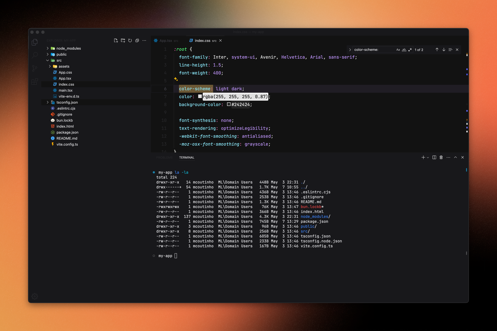

# Loki Theme for VS Code.

Loki is composed of a dark background with [Dracula Refined](https://github.com/mathcale/dracula-theme-refined) highlights tones for the editor, offering a comfortable and modern coding environment.

# Installation

1. Open **Extensions** sidebar panel in VS Code. `View > Extensions`
2. Search for **`Loki Theme`**
3. Click **Install** to install it.
4. `Code > Preferences > Color Theme > Loki - Loki Contrast`

The theme is available for editors; shells, UI's and more coming up.

## Available Options
- Loki
- Loki Contrast

### EXAMPLES

You have two themes, Loki &amp; Contrast and here the screenshots:

### Loki




### Loki Contrast


## Personal Settings

```json
{
  "editor.fontFamily": "JetBrains Mono",
  "editor.fontSize": 16,
  "editor.lineHeight": 1.8,
  "editor.fontLigatures": true,
  "editor.cursorBlinking": "phase",
  "editor.renderWhitespace": "all",
  "editor.rulers": [80, 120],
  "editor.minimap.enabled": false,
  "breadcrumbs.enabled": false,
  "workbench.statusBar.visible": false,
}
```

Loki Theme created by [Melquisedec Felipe](https://github.com/melquisedecfelipe).
